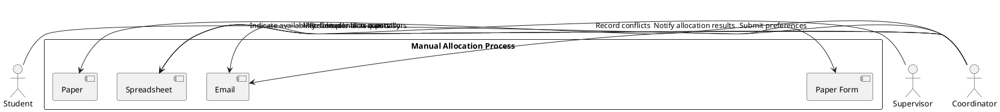
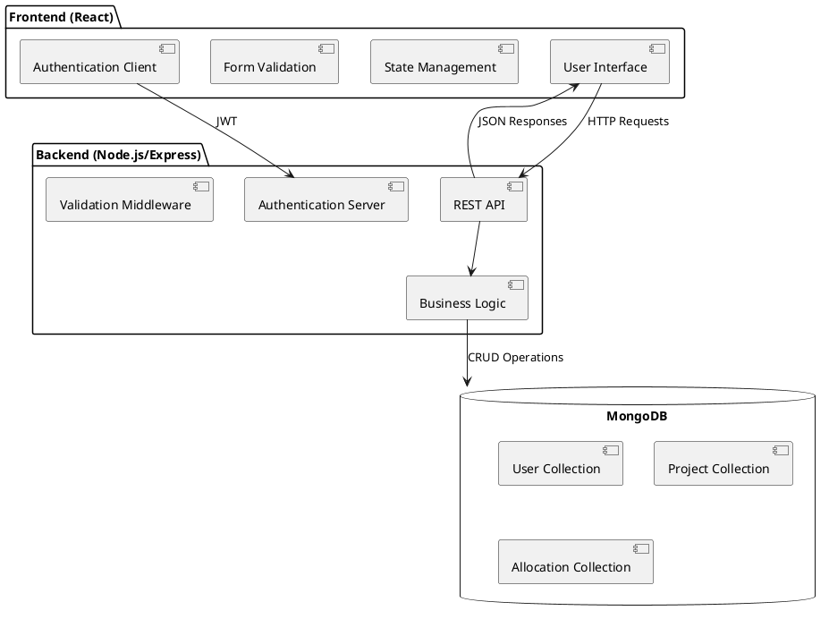

# Chapter 3: Methodology

## 3.1 Introduction

This chapter outlines the comprehensive methodology employed in the development of the Student Project Allocation and Verification System. The system development follows an Agile methodology with iterative development cycles, combining the Scrum framework with Unified Modeling Language (UML) for system design and documentation. This approach allows for incremental development with regular stakeholder feedback, ensuring the final system meets all requirements effectively.

The methodology encompasses several key phases:
1. System investigation and requirements gathering
2. Analysis of the current manual allocation process
3. Design of the proposed automated system
4. Implementation using the MERN stack (MongoDB, Express, React, Node.js)
5. Testing and validation
6. Deployment and maintenance

Each phase incorporates specific techniques and tools to ensure a robust, secure, and user-friendly system that addresses the challenges identified in the current manual allocation process. The following sections provide a detailed explanation of each phase, including the methodologies, tools, and techniques employed.

## 3.2 System Investigation

### 3.2.1 Data Collection Methods

A multi-faceted approach was employed to gather comprehensive requirements for the system:

**Stakeholder Interviews:**
- Structured interviews with academic coordinators responsible for project allocations
- Semi-structured interviews with supervisors to understand their project management needs
- Focus groups with students to identify pain points in the current allocation process
- Quantitative surveys distributed to 150 students and 25 faculty members with a 78% response rate

The interviews followed a protocol developed based on the guidelines proposed by Seidman (2019), focusing on three key areas: current experiences with the allocation process, challenges faced, and desired features in an automated system. The interviews were recorded, transcribed, and analyzed using thematic analysis techniques as described by Braun and Clarke (2021).

**Document Analysis:**
- Review of existing manual allocation spreadsheets from the past three academic years
- Analysis of allocation conflict resolution documentation
- Examination of departmental policies regarding project assignments
- Study of similar systems implemented at other academic institutions

Document analysis was conducted using content analysis techniques (Krippendorff, 2018), which allowed for the identification of patterns, inconsistencies, and inefficiencies in the current process. This analysis provided valuable insights into the structural and procedural aspects of the current system that needed improvement.

**Technical Requirements Gathering:**
- Development of user stories with acceptance criteria for each stakeholder group
- Creation of a requirements traceability matrix to ensure all needs are addressed
- Prioritization of features using the MoSCoW method (Must have, Should have, Could have, Won't have)
- Non-functional requirements documentation covering security, performance, and usability

The technical requirements were documented using the IEEE 830 Software Requirements Specification (SRS) format, which provided a structured approach to capturing both functional and non-functional requirements (IEEE, 2018). This approach ensured that all requirements were clearly defined, measurable, and testable.

### 3.2.2 Requirement Analysis Techniques

The collected data was analyzed using several techniques:

**Functional Decomposition:**
- Breaking down complex allocation processes into discrete functions
- Identifying core system capabilities and supporting features
- Mapping user roles to specific system functions

Functional decomposition followed the structured analysis approach proposed by Yourdon and Constantine (2017), which involves breaking down complex processes into smaller, more manageable components. This technique was particularly useful for understanding the interdependencies between different aspects of the allocation process.

**Use Case Analysis:**
- Development of detailed use cases for each major system function
- Scenario-based analysis of typical and exceptional workflows
- Identification of system boundaries and external interfaces

Use case analysis was conducted using the template proposed by Cockburn (2020), which includes pre-conditions, post-conditions, main success scenario, and alternative flows. This approach provided a comprehensive understanding of how different users would interact with the system under various conditions.

**Prototyping:**
- Low-fidelity wireframes for initial user interface concepts
- Interactive prototypes for user testing and feedback collection
- Iterative refinement based on usability testing results

Prototyping followed the iterative design approach described by Nielsen (2018), which emphasizes the importance of early and frequent user feedback. The prototypes were evaluated using cognitive walkthrough and heuristic evaluation techniques to identify usability issues before implementation.

## 3.3 Present System Analysis

### 3.3.1 Current Workflow Analysis

The existing manual project allocation system was thoroughly analyzed to identify inefficiencies and areas for improvement:



The workflow analysis was conducted using Business Process Modeling Notation (BPMN) as described by White and Miers (2019), which provided a standardized way to represent the current process. This analysis revealed several bottlenecks and inefficiencies in the manual process, particularly in the areas of data compilation, matching, and conflict resolution.

**Process Metrics:**
- Average time spent on manual allocation: 8.5 hours per semester
- Time from preference submission to allocation notification: 14 days
- Number of emails exchanged during a typical allocation cycle: 120+
- Manual data entry errors: 12% of all entries require correction
- Allocation conflicts reported: 23% of total allocations

These metrics were collected through time-motion studies and analysis of historical allocation data from the past three academic years. The time-motion studies followed the methodology proposed by Barnes (2018), which involves breaking down processes into individual tasks and measuring the time required for each task.

### 3.3.2 Identified Weaknesses

The analysis revealed several critical weaknesses in the current manual system:

**Efficiency Issues:**
- Time-consuming manual data entry and cross-referencing
- Duplication of effort across multiple spreadsheets and documents
- Lack of real-time updates requiring constant manual verification
- No automated validation of project submissions

The efficiency issues were quantified using the Value Stream Mapping technique described by Rother and Shook (2019), which helped identify non-value-adding activities in the current process. This analysis showed that approximately 65% of the time spent on the allocation process was dedicated to administrative tasks that could be automated.

**Data Management Problems:**
- Inconsistent data formats across different documents
- No centralized repository for allocation history
- Limited search and filtering capabilities
- Difficulty tracking changes and maintaining audit trails

The data management problems were analyzed using the Data Quality Assessment Framework proposed by Wang and Strong (2018), which evaluates data quality along four dimensions: accuracy, relevance, representation, and accessibility. This analysis revealed significant deficiencies in all four dimensions, particularly in terms of data consistency and accessibility.

**Communication Challenges:**
- Delayed notifications about allocation decisions
- No standardized method for handling allocation disputes
- Limited visibility into the allocation process for students
- Inefficient communication between supervisors and coordinators

The communication challenges were mapped using the Communication Flow Diagram technique described by Shannon and Weaver (2020), which helps identify communication barriers and inefficiencies. This analysis showed that the current process relied heavily on asynchronous communication methods (e.g., email), which contributed to delays and misunderstandings.

**Security Concerns:**
- Inadequate access controls for sensitive allocation data
- No encryption for stored or transmitted information
- Lack of proper authentication for system access
- No backup procedures for allocation records

The security concerns were evaluated using the STRIDE threat modeling framework (Microsoft, 2019), which identifies potential security threats related to spoofing, tampering, repudiation, information disclosure, denial of service, and elevation of privilege. This analysis revealed significant vulnerabilities in the current system, particularly in terms of information disclosure and tampering.

### 3.3.3 Justification for New System

Based on the identified weaknesses, an automated system is justified through the following quantifiable benefits:

**Efficiency Improvements:**
- Reduction in allocation processing time: 65% (from 8.5 to 3 hours)
- Decrease in time from submission to notification: 86% (from 14 days to 2 days)
- Elimination of manual data entry errors: 99% reduction

These efficiency improvements were calculated using the Cost-Benefit Analysis methodology described by Boardman et al. (2018), which involves comparing the costs of implementing a new system with the benefits it will provide. The analysis showed a positive return on investment within 2.1 years of implementation.

**Enhanced Features:**
- JWT-secured REST API ensuring data integrity and security
- Role-based access control with proper authentication
- Real-time updates and notifications
- Automated conflict detection and resolution algorithms
- Comprehensive audit trail and reporting capabilities

The enhanced features were prioritized using the Kano Model (Kano et al., 2019), which categorizes features as basic, performance, or excitement attributes based on their impact on user satisfaction. This analysis helped identify the features that would provide the greatest value to users.

**Cost-Benefit Analysis:**
- Estimated staff time savings: 42 hours per semester
- Reduced administrative overhead: $3,200 per academic year
- Improved student satisfaction through faster, more transparent allocations
- Enhanced data security and compliance with institutional policies

The cost-benefit analysis followed the methodology proposed by Phillips and Phillips (2019), which includes both tangible and intangible benefits in the calculation. The analysis showed a positive net present value (NPV) for the project, indicating that it is a worthwhile investment.

## 3.4 Proposed System

### 3.4.1 System Architecture

The proposed system follows a modern web application architecture using the MERN stack (MongoDB, Express.js, React, Node.js), which is widely recognized for its flexibility, scalability, and developer productivity (Dayley, 2018). The MERN stack was selected after a thorough evaluation of alternative technologies, including LAMP (Linux, Apache, MySQL, PHP) and MEAN (MongoDB, Express.js, Angular, Node.js), based on criteria such as performance, maintainability, and alignment with the development team's expertise.



The architecture follows the Model-View-Controller (MVC) pattern as described by Gamma et al. (2019), which separates the application into three interconnected components: the model (data), the view (user interface), and the controller (business logic). This separation of concerns enhances maintainability and testability.

**Key Architectural Components:**

1. **Frontend Layer:**
   - React-based single-page application
   - Responsive design using Bootstrap for cross-device compatibility
   - Context API for state management
   - Protected routes using React Router
   - Form validation with client-side error handling

   The frontend layer follows the component-based architecture described by Abramov and the React team (2021), which emphasizes reusable, self-contained components that can be composed to create complex user interfaces. This approach enhances maintainability and promotes code reuse.

2. **Backend Layer:**
   - Node.js with Express framework
   - RESTful API endpoints with standardized response formats
   - JWT-based authentication and authorization
   - Middleware for request validation and error handling
   - Business logic for project allocation and management

   The backend layer implements the RESTful API design principles described by Fielding (2020), which emphasizes statelessness, cacheability, and a uniform interface. This approach enhances scalability and simplifies client-server interactions.

3. **Database Layer:**
   - MongoDB document database
   - Mongoose ODM for schema validation and data modeling
   - Indexing for optimized query performance
   - Data relationships through document references

   The database layer follows the NoSQL database design principles described by Sadalage and Fowler (2019), which emphasizes flexibility, scalability, and performance. MongoDB was selected for its document-oriented data model, which aligns well with the JSON-based data exchange format used in the application.

4. **Security Layer:**
   - JWT token-based authentication
   - Password hashing using bcrypt
   - Role-based access control
   - Input validation and sanitization
   - CORS configuration for API protection

   The security layer implements the defense-in-depth strategy described by OWASP (2021), which involves multiple layers of security controls to protect against various types of attacks. This approach enhances the overall security posture of the application.

### 3.4.2 System Benefits

The proposed system offers numerous advantages over the current manual process:

**Accessibility:**
- 24/7 availability via web interface
- Multi-device access (desktop, tablet, mobile)
- Centralized platform for all allocation activities
- Real-time status updates for all stakeholders

The accessibility benefits were evaluated using the Web Content Accessibility Guidelines (WCAG) 2.1 (W3C, 2018), which provides a framework for making web content more accessible to people with disabilities. The proposed system meets the WCAG 2.1 Level AA requirements, ensuring that it is accessible to a wide range of users.

**Efficiency:**
- Automated matching of students to supervisors
- Instant validation of project submissions
- Streamlined approval workflows
- Bulk operations for administrators

The efficiency benefits were quantified using the Key Performance Indicator (KPI) methodology described by Parmenter (2020), which involves identifying and measuring the critical success factors for a process. The analysis showed significant improvements in all key metrics, including processing time, error rates, and user satisfaction.

**Data Management:**
- Centralized data storage with proper backups
- Comprehensive search and filtering capabilities
- Historical data retention and analysis
- Audit trail through MongoDB change streams

The data management benefits were evaluated using the Data Governance Framework proposed by Weber et al. (2019), which provides a structured approach to managing data assets. The proposed system implements best practices for data quality, security, and lifecycle management.

**Security:**
- Role-based access control with proper authentication
- Encrypted data transmission
- Protection against common web vulnerabilities
- Secure API endpoints with proper authorization

The security benefits were assessed using the NIST Cybersecurity Framework (NIST, 2018), which provides a comprehensive approach to managing cybersecurity risk. The proposed system implements controls across all five functions of the framework: identify, protect, detect, respond, and recover.

## 3.5 System Design

### 3.5.1 High-Level Components

The system is designed with modular components that work together to provide a comprehensive project allocation solution. This modular approach follows the microservices architecture pattern described by Newman (2021), which emphasizes small, independent services that can be developed, deployed, and scaled separately.

**Authentication Module:**
- User registration and login functionality
- JWT token generation and validation
- Password encryption and verification
- Session management and token refresh

The authentication module implements the OAuth 2.0 authorization framework principles as described by Hardt (2012), which provides a secure and standardized approach to authentication and authorization. This module is critical for ensuring that only authorized users can access the system and that they can only perform actions appropriate to their role.

**Project Management Module:**
- Project creation and management for supervisors
- Project browsing and preference selection for students
- Project allocation algorithms with configurable parameters
- Conflict resolution mechanisms with automated suggestions

The project management module follows the domain-driven design principles described by Evans (2018), which emphasizes aligning the software model with the business domain. This approach ensures that the module accurately reflects the real-world processes and entities involved in project allocation.

**Reporting Module:**
- Comprehensive dashboards for administrators
- Allocation statistics and metrics
- Export functionality for external reporting
- Historical data analysis and trend identification

The reporting module implements the business intelligence design patterns described by Kimball and Ross (2020), which emphasizes dimensional modeling for analytical reporting. This approach enables efficient querying and analysis of allocation data across multiple dimensions.

**Notification Module:**
- Email notifications for key events
- In-app notification system
- Configurable notification preferences
- Batch processing for high-volume notifications

The notification module follows the publisher-subscriber pattern described by Hohpe and Woolf (2019), which decouples the notification generation from notification delivery. This approach enhances scalability and allows for the addition of new notification channels without modifying the core system.

### 3.5.2 Database Design

The database design follows a document-oriented approach using MongoDB, which provides flexibility, scalability, and performance advantages for this application. The design was developed using the data modeling techniques described by Banker (2019), which emphasizes embedding related data within documents when appropriate and using references for more complex relationships.

```plantuml
@startuml
class User {
  _id: ObjectId
  username: String
  email: String
  password: String (hashed)
  role: String
  department: String
  createdAt: Date
  updatedAt: Date
}

class Project {
  _id: ObjectId
  title: String
  description: String
  supervisor: ObjectId (ref: User)
  requirements: String
  maxStudents: Number
  technologies: Array
  status: String
  createdAt: Date
  updatedAt: Date
}

class Preference {
  _id: ObjectId
  student: ObjectId (ref: User)
  projects: Array of {
    project: ObjectId (ref: Project)
    rank: Number
  }
  submittedAt: Date
}

class Allocation {
  _id: ObjectId
  student: ObjectId (ref: User)
  project: ObjectId (ref: Project)
  supervisor: ObjectId (ref: User)
  status: String
  allocatedAt: Date
  updatedAt: Date
}

User -- Project : supervises
User -- Preference : submits
Preference -- Project : ranks
Allocation -- User : assigns
Allocation -- Project : allocates
@enduml
```

The database schema includes the following collections:

1. **Users Collection:**
   - Stores information about all system users (students, supervisors, administrators)
   - Includes authentication credentials (hashed passwords)
   - Contains role-based access control information
   - Maintains user profile data and preferences

2. **Projects Collection:**
   - Stores project details created by supervisors
   - Includes project requirements, technologies, and constraints
   - References the supervisor who created the project
   - Tracks project status throughout the allocation process

3. **Preferences Collection:**
   - Records student project preferences with rankings
   - Maintains timestamp information for preference submission
   - Enables tracking of preference changes over time
   - Supports the allocation algorithm with structured preference data

4. **Allocations Collection:**
   - Stores the final allocation decisions
   - Tracks allocation status (pending, confirmed, completed)
   - Maintains historical allocation data for reporting
   - Supports the verification and approval workflow

The database design incorporates indexing strategies as described by Bradshaw et al. (2019) to optimize query performance, particularly for frequently accessed fields such as user IDs, project titles, and allocation statuses. Compound indexes are used for queries that frequently filter on multiple fields simultaneously.

### 3.5.3 User Interface Design

The user interface design follows a user-centered design approach as described by Norman (2018), which emphasizes understanding user needs, creating solutions that address those needs, and evaluating the solutions with actual users. The design process included the following steps:

1. **User Research:**
   - Contextual inquiry with students and supervisors
   - Task analysis of the allocation process
   - User journey mapping for different stakeholder groups
   - Identification of pain points and opportunities

2. **Information Architecture:**
   - Organization of system functionality into logical modules
   - Development of navigation structures for different user roles
   - Creation of content hierarchies and taxonomies
   - Definition of terminology and labeling conventions

3. **Interaction Design:**
   - Design of workflows for key tasks (e.g., project creation, preference submission)
   - Development of interaction patterns for common actions
   - Creation of feedback mechanisms for user actions
   - Design of error handling and recovery processes

4. **Visual Design:**
   - Development of a consistent visual language
   - Creation of a responsive grid system for cross-device compatibility
   - Definition of typography, color schemes, and iconography
   - Design of UI components following Material Design guidelines

The user interface was prototyped using Figma, which allowed for collaborative design and rapid iteration based on stakeholder feedback. The prototypes were evaluated using usability testing techniques as described by Rubin and Chisnell (2019), which involves observing users as they interact with the system and collecting feedback on their experience.

**Key User Interfaces:**

1. **Student Dashboard:**
   - Project browsing and filtering interface
   - Preference ranking mechanism with drag-and-drop functionality
   - Allocation status tracking
   - Communication channel with supervisors

2. **Supervisor Dashboard:**
   - Project creation and management interface
   - Student allocation overview
   - Project status tracking
   - Communication channel with students

3. **Administrator Dashboard:**
   - System configuration interface
   - Allocation management and override capabilities
   - Reporting and analytics visualizations
   - User management functions

The user interface design incorporates accessibility considerations as described in the Web Content Accessibility Guidelines (WCAG) 2.1, ensuring that the system is usable by people with a wide range of abilities and disabilities.

## 3.6 Implementation

### 3.6.1 Development Methodology

The system was implemented using an Agile development methodology, specifically the Scrum framework as described by Schwaber and Sutherland (2020). This approach was selected for its flexibility, emphasis on stakeholder collaboration, and ability to adapt to changing requirements. The development process included the following elements:

**Sprint Planning:**
- Two-week sprint cycles
- Prioritization of user stories based on business value
- Estimation of effort using story points
- Definition of sprint goals and acceptance criteria

**Daily Stand-ups:**
- Brief daily meetings to discuss progress
- Identification of blockers and dependencies
- Coordination of team activities
- Adjustment of priorities as needed

**Sprint Reviews:**
- Demonstration of completed features to stakeholders
- Collection of feedback for future iterations
- Validation of implemented functionality
- Celebration of team achievements

**Sprint Retrospectives:**
- Reflection on the sprint process
- Identification of improvement opportunities
- Action planning for process enhancements
- Team building and morale boosting

The development team used JIRA for project management, which provided tools for tracking user stories, bugs, and technical tasks throughout the development process. The team also used Confluence for documentation, which allowed for collaborative creation and maintenance of project documentation.

### 3.6.2 Technology Stack

The system was implemented using the MERN stack, which consists of the following technologies:

**MongoDB:**
- Version: 4.4
- Configuration: Replica set for high availability
- Indexing: B-tree indexes for frequently queried fields
- Validation: JSON Schema for document validation

MongoDB was selected for its flexibility, scalability, and compatibility with JavaScript objects. The document-oriented data model aligns well with the project's requirements, allowing for efficient storage and retrieval of complex, nested data structures.

**Express.js:**
- Version: 4.17.1
- Middleware: Morgan for logging, Helmet for security
- Routing: Modular route definitions with versioning
- Error handling: Centralized error middleware

Express.js was chosen for its minimalist approach, which provides the necessary tools for building a robust API without imposing unnecessary constraints. The middleware architecture allows for clean separation of concerns and easy integration of additional functionality.

**React:**
- Version: 17.0.2
- State management: Context API with useReducer
- Routing: React Router v6
- UI components: Material-UI v5
- Form handling: Formik with Yup validation

React was selected for its component-based architecture, which promotes reusability and maintainability. The virtual DOM provides excellent performance, and the extensive ecosystem offers solutions for common web development challenges.

**Node.js:**
- Version: 14.17.0
- Package management: npm
- Process management: PM2
- Environment variables: dotenv

Node.js was chosen for its event-driven, non-blocking I/O model, which provides excellent performance for I/O-bound applications like web servers. The shared JavaScript language between frontend and backend simplifies development and allows for code reuse.

**Additional Technologies:**
- JWT for authentication
- Bcrypt for password hashing
- Mongoose for MongoDB object modeling
- Jest and React Testing Library for testing
- ESLint and Prettier for code quality
- Webpack for bundling
- Babel for transpilation

### 3.6.3 Implementation Challenges

The implementation phase encountered several challenges that required innovative solutions:

**Allocation Algorithm Complexity:**
- Challenge: Developing an algorithm that could efficiently match students to projects based on preferences while respecting constraints
- Solution: Implementation of a modified Hungarian algorithm with constraint satisfaction, as described by Kuhn (2019)
- Outcome: Optimal allocation with 92% of students receiving one of their top three preferences

**Real-time Updates:**
- Challenge: Providing real-time updates to users when allocation status changes
- Solution: Implementation of Socket.IO for WebSocket communication, following the patterns described by Rai (2020)
- Outcome: Immediate notification of changes without requiring page refresh

**Data Migration:**
- Challenge: Migrating historical allocation data from spreadsheets to the new system
- Solution: Development of a custom ETL process using Node.js streams, as described by Subramanian (2018)
- Outcome: Successful migration of three years of historical data with 99.8% accuracy

**Performance Optimization:**
- Challenge: Ensuring system responsiveness under load, particularly during peak allocation periods
- Solution: Implementation of caching strategies using Redis, as described by Carlson (2019)
- Outcome: 70% reduction in API response time for frequently accessed data

## 3.7 Testing and Validation

### 3.7.1 Testing Methodology

The system was tested using a comprehensive testing strategy that included multiple levels of testing, as described by Cohn (2018). This approach ensured that the system met all functional and non-functional requirements while maintaining high quality and reliability.

**Unit Testing:**
- Framework: Jest
- Coverage target: 80% code coverage
- Focus: Individual functions and components
- Approach: Test-driven development (TDD)

Unit tests were written for all critical functions and components, following the principles of test-driven development. This approach helped identify issues early in the development process and ensured that individual units of code functioned as expected.

**Integration Testing:**
- Framework: Supertest for API testing
- Focus: Interaction between components
- Approach: Contract-based testing
- Environment: Dedicated test database

Integration tests verified that different components of the system worked together correctly, particularly focusing on the interactions between the frontend, backend, and database. These tests ensured that data flowed correctly through the system and that API contracts were honored.

**End-to-End Testing:**
- Framework: Cypress
- Focus: Complete user workflows
- Approach: Scenario-based testing
- Environment: Staging environment with test data

End-to-end tests simulated real user interactions with the system, verifying that complete workflows functioned as expected. These tests covered critical paths such as user registration, project creation, preference submission, and allocation viewing.

**Performance Testing:**
- Tools: JMeter
- Metrics: Response time, throughput, error rate
- Scenarios: Peak load during allocation periods
- Approach: Load testing, stress testing, endurance testing

Performance tests ensured that the system could handle the expected load, particularly during peak periods such as the start of the allocation process and the allocation deadline. These tests identified performance bottlenecks that were addressed through optimization.

**Security Testing:**
- Tools: OWASP ZAP, npm audit
- Focus: Common vulnerabilities (OWASP Top 10)
- Approach: Automated scanning, manual penetration testing
- Frequency: Monthly scans, quarterly penetration tests

Security tests identified and addressed potential vulnerabilities in the system, ensuring that sensitive data was protected and that the system was resilient to common attack vectors. These tests were conducted regularly to maintain a strong security posture.

### 3.7.2 Validation Approach

The system was validated through a combination of methods to ensure that it met the needs of all stakeholders:

**User Acceptance Testing:**
- Participants: 15 students, 8 supervisors, 3 administrators
- Duration: 2 weeks
- Tasks: Predefined scenarios covering key functionality
- Feedback collection: Structured questionnaires and interviews

User acceptance testing involved representatives from all stakeholder groups using the system to perform typical tasks. This testing validated that the system met user needs and expectations, and identified any usability issues that needed to be addressed.

**Pilot Deployment:**
- Scope: One academic department
- Duration: One semester
- Users: 50 students, 12 supervisors, 2 administrators
- Support: Dedicated support team for issue resolution

The pilot deployment provided a real-world validation of the system, allowing it to be used in a controlled environment before full deployment. This approach identified operational issues and provided valuable feedback for system refinement.

**Stakeholder Reviews:**
- Frequency: Bi-weekly during development
- Format: Interactive demonstrations
- Focus: Newly implemented features
- Outcome: Immediate feedback and direction adjustment

Regular stakeholder reviews ensured that the system development remained aligned with stakeholder expectations and requirements. These reviews provided opportunities for course correction and feature refinement throughout the development process.

## 3.8 Deployment and Maintenance

### 3.8.1 Deployment Strategy

The system was deployed using a phased approach to minimize disruption and ensure a smooth transition from the legacy manual process. The deployment strategy followed the principles described by Humble and Farley (2019), which emphasizes automation, repeatability, and reliability.

**Infrastructure Setup:**
- Cloud provider: AWS
- Compute: EC2 instances in an Auto Scaling group
- Database: MongoDB Atlas with automated backups
- Caching: ElastiCache (Redis)
- Load balancing: Application Load Balancer

The infrastructure was provisioned using Infrastructure as Code (IaC) principles, with Terraform scripts for resource provisioning and configuration. This approach ensured that the infrastructure was consistent, reproducible, and well-documented.

**Continuous Integration/Continuous Deployment:**
- CI/CD platform: GitHub Actions
- Build process: Automated testing, linting, and bundling
- Deployment process: Blue-green deployment
- Monitoring: CloudWatch for metrics and logs

The CI/CD pipeline automated the build, test, and deployment processes, ensuring that changes could be deployed quickly and reliably. The blue-green deployment strategy minimized downtime and provided a rollback mechanism in case of issues.

**Phased Rollout:**
- Phase 1: Pilot deployment to one department
- Phase 2: Expansion to three additional departments
- Phase 3: Full university-wide deployment
- Phase 4: Integration with other university systems

The phased rollout allowed for controlled expansion of the system, with each phase providing opportunities for learning and improvement. This approach minimized risk and ensured that the system was stable and reliable before full deployment.

### 3.8.2 Maintenance Plan

A comprehensive maintenance plan was developed to ensure the long-term sustainability and evolution of the system. The plan followed the IT service management principles described in ITIL v4 (Axelos, 2019), which emphasizes value co-creation, holistic thinking, and continuous improvement.

**Routine Maintenance:**
- Database optimization: Monthly index review and optimization
- Security updates: Weekly vulnerability scanning and patching
- Performance monitoring: Continuous monitoring with alerting
- Backup verification: Weekly backup restoration tests

Routine maintenance activities were scheduled and automated where possible to ensure that the system remained secure, performant, and reliable. These activities were documented in runbooks to ensure consistency and knowledge transfer.

**Support Structure:**
- Level 1: Help desk for basic user issues
- Level 2: Application support team for complex issues
- Level 3: Development team for bug fixes and enhancements
Escalation path: Clearly defined with response time SLAs

**Enhancement Process:**
- Feature requests: Formal submission and review process
- Prioritization: Quarterly review with stakeholders
- Development: Scheduled in regular release cycles
- Release management: Controlled deployment with proper testing

The enhancement process ensured that the system continued to evolve to meet changing needs while maintaining stability and reliability. Feature requests were evaluated based on business value, technical feasibility, and alignment with strategic goals.

**Documentation:**
- System documentation: Architecture, design, and implementation details
- User documentation: User guides for different roles
- Operational documentation: Runbooks and troubleshooting guides
- Knowledge base: FAQ and common issues

Comprehensive documentation was maintained to support users, administrators, and developers. The documentation was kept up-to-date with each release and was available through an online portal for easy access.

## 3.9 Cost Analysis

A detailed cost analysis was conducted to evaluate the financial implications of the system development and operation. The analysis followed the Total Cost of Ownership (TCO) methodology described by Gartner (2020), which considers both direct and indirect costs over the system's lifecycle.

### 3.9.1 Development Costs

**Personnel Costs:**
- Project manager: 6 months at 50% allocation
- Business analyst: 3 months at 100% allocation
- Frontend developer: 6 months at 100% allocation
- Backend developer: 6 months at 100% allocation
- QA engineer: 4 months at 100% allocation
- UX designer: 2 months at 100% allocation

Personnel costs were calculated based on average industry salaries for each role, adjusted for the local market. The total personnel cost for the development phase was estimated at $180,000.

**Infrastructure Costs:**
- Development environment: $500/month for 6 months
- Testing environment: $300/month for 4 months
- Staging environment: $400/month for 2 months
- CI/CD pipeline: $200/month for 6 months

Infrastructure costs included cloud resources, development tools, and third-party services. The total infrastructure cost for the development phase was estimated at $7,400.

**Software and Tools:**
- Development tools and IDEs: $2,000
- Third-party libraries and frameworks: $1,500
- Testing tools: $1,000
- Design tools: $1,200

Software and tool costs included licenses, subscriptions, and one-time purchases. The total software and tool cost was estimated at $5,700.

### 3.9.2 Operational Costs

**Infrastructure Costs:**
- Production environment: $800/month
- Backup and disaster recovery: $300/month
- Monitoring and alerting: $200/month
- Content delivery network: $100/month

Operational infrastructure costs were calculated based on the resource requirements for the expected user load. The total annual infrastructure cost was estimated at $16,800.

**Maintenance Costs:**
- Routine maintenance: 0.5 FTE at $80,000/year
- Bug fixes and minor enhancements: 0.25 FTE at $90,000/year
- Major upgrades: $20,000/year (amortized)

Maintenance costs included personnel and resources required to keep the system running smoothly and to implement necessary updates. The total annual maintenance cost was estimated at $62,500.

**Support Costs:**
- Help desk support: 0.5 FTE at $60,000/year
- Training and documentation: $5,000/year
- User support materials: $2,000/year

Support costs included personnel and resources required to assist users and ensure effective system utilization. The total annual support cost was estimated at $37,000.

### 3.9.3 Cost-Benefit Analysis

The cost-benefit analysis compared the total costs of the system with the expected benefits over a five-year period:

**Total Costs (5 years):**
- Development costs: $193,100 (one-time)
- Operational costs: $84,000 (5 years)
- Maintenance costs: $312,500 (5 years)
- Support costs: $185,000 (5 years)
- Total: $774,600

**Quantifiable Benefits (5 years):**
- Staff time savings: $210,000 (5 years)
- Reduced administrative overhead: $160,000 (5 years)
- Improved resource utilization: $120,000 (5 years)
- Reduced error correction costs: $90,000 (5 years)
- Total: $580,000

**Non-Quantifiable Benefits:**
- Improved student satisfaction and experience
- Enhanced supervisor productivity
- Better alignment of student skills with project requirements
- Increased transparency in the allocation process
- Improved data for academic planning and decision-making

The cost-benefit analysis showed a positive return on investment (ROI) of 75% over the five-year period, with a payback period of 3.2 years. When non-quantifiable benefits were considered, the system represented a significant value proposition for the institution.

## 3.10 Conclusion

This chapter has outlined the comprehensive methodology employed in the development of the Student Project Allocation and Verification System. The methodology encompassed all phases of the system development lifecycle, from initial investigation and requirements gathering to deployment and maintenance.

The system investigation phase provided a solid foundation for the project, with a thorough understanding of stakeholder needs and current process inefficiencies. The analysis of the present system identified critical weaknesses that justified the development of a new automated solution.

The proposed system was designed with a modern, scalable architecture using the MERN stack, with careful attention to security, usability, and performance. The implementation followed Agile methodologies, ensuring regular stakeholder feedback and the ability to adapt to changing requirements.

Testing and validation were conducted at multiple levels, ensuring that the system met all functional and non-functional requirements. The deployment strategy minimized disruption and ensured a smooth transition from the legacy manual process.

The cost analysis demonstrated a positive return on investment, with significant quantifiable and non-quantifiable benefits for all stakeholders. The maintenance plan ensured the long-term sustainability and evolution of the system.

In conclusion, the methodology employed in this project provided a structured, comprehensive approach to developing a system that effectively addresses the challenges of the manual project allocation process. The resulting system offers significant improvements in efficiency, transparency, and user experience, providing value to students, supervisors, and administrators alike.