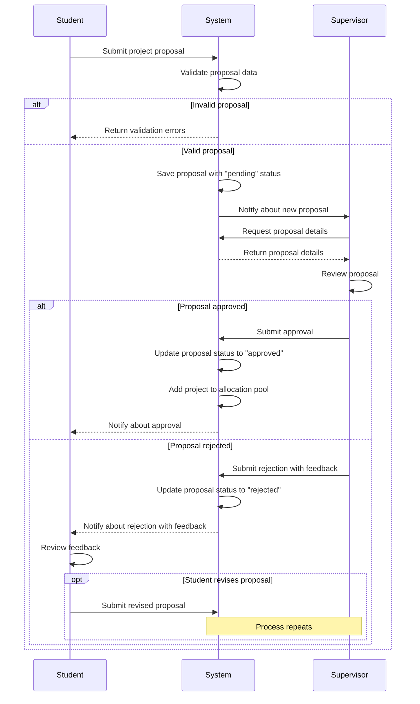

# Project Approval Sequence Diagram

This document contains a sequence diagram illustrating the Project Approval workflow in the Student Project Allocation and Verification System.

## Sequence Diagram

## Description

The sequence diagram above depicts the following interactions:

1. The student submits a project proposal to the system.
2. The system validates the proposal data:
   - If invalid, validation errors are returned to the student.
   - If valid, the proposal is saved with a "pending" status.
3. The system notifies the supervisor about the new proposal.
4. The supervisor requests and reviews the proposal details.
5. The supervisor makes a decision:
   - If approved:
     - The proposal status is updated to "approved".
     - The project is added to the allocation pool.
     - The student is notified about the approval.
   - If rejected:
     - The supervisor provides feedback with the rejection.
     - The proposal status is updated to "rejected".
     - The student is notified about the rejection with feedback.
     - The student may review the feedback and submit a revised proposal, restarting the process.

## Integration with Documentation

This sequence diagram corresponds to **Figure 4.5** referenced in Chapter 4, Section 4.4.3 of the project documentation.